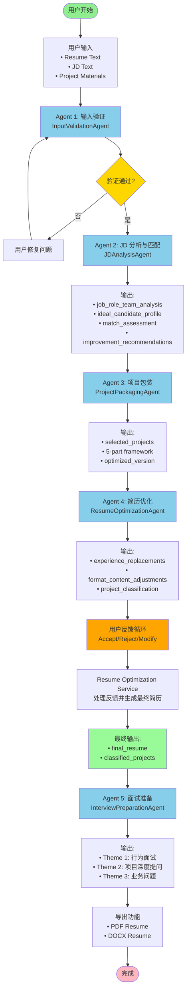
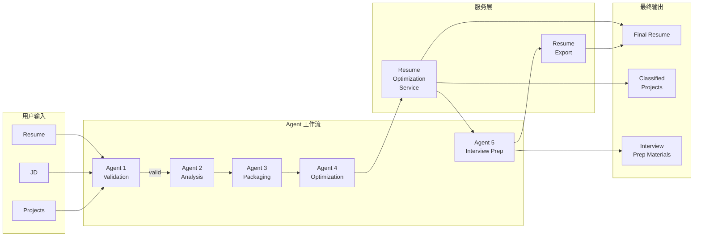
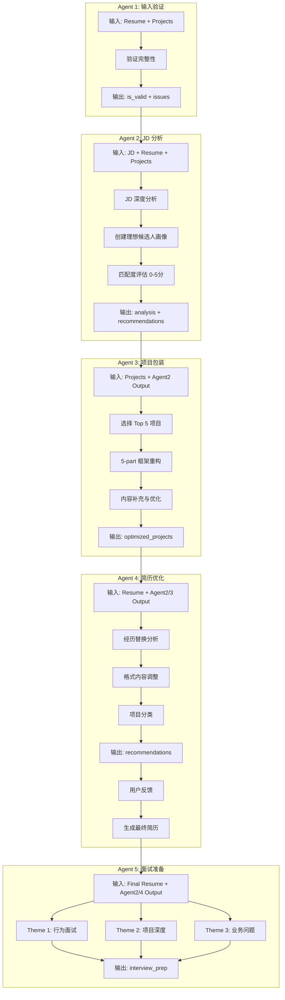
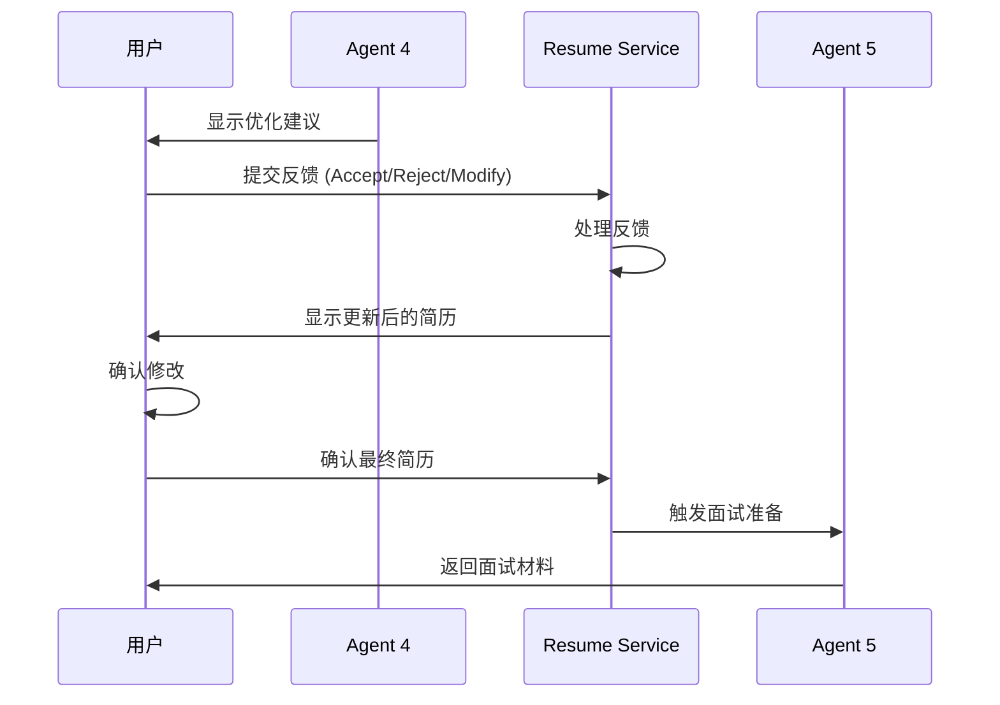
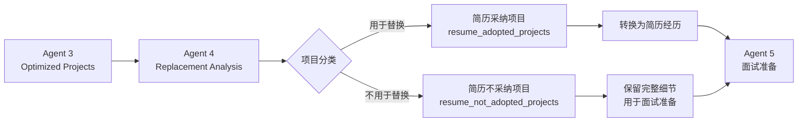
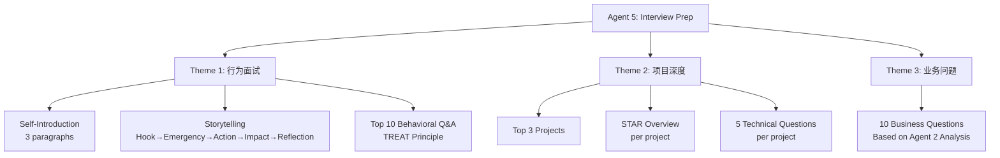
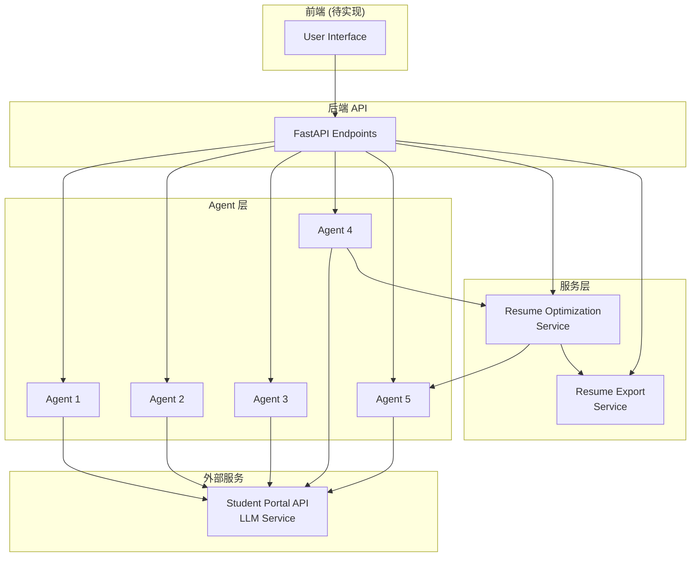

# AI Job Hunting Assistant - Workflow Diagram (Mermaid)

## 完整应用工作流程图

## 数据流图

## Agent 详细流程

## 用户反馈循环

## 项目分类流程

## 面试准备主题结构

## 完整系统架构

---

**Note**: 这些 Mermaid 图表可以在支持 Mermaid 的 Markdown 查看器中渲染（如 GitHub, GitLab, VS Code with Mermaid extension 等）。
